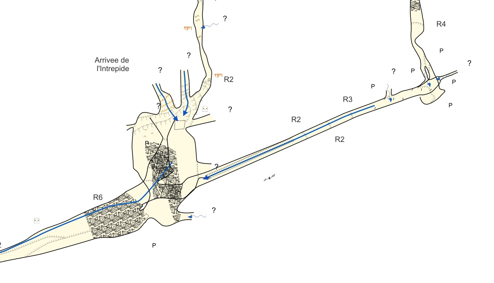
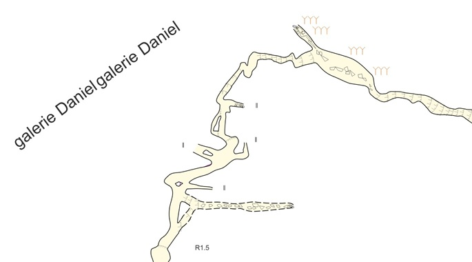

QGis Collection for Therion survey
==================================

🇫🇷 [Lire en Français](./README.md)

This repository contains QGis layer definitions and SVG symbols for visualizing Therion survey in QGis.

The set is based on the standard UIS symbols.

For more details, models, and scripts are available at https://github.com/robertxa/Topographies-Samoens_Folly.

Description
-----------

QGis screenshot,

  

License
-------

All these data are published under the Creative Commons CC BY-NC-ND 4.0 free license (Attribution, ShareAlike, and No Commercial Use):
https://creativecommons.org/licenses/by-nc-nd/4.0/

Author
------

Alexandre PONT (alexandre dot pont at yahoo dot fr)
